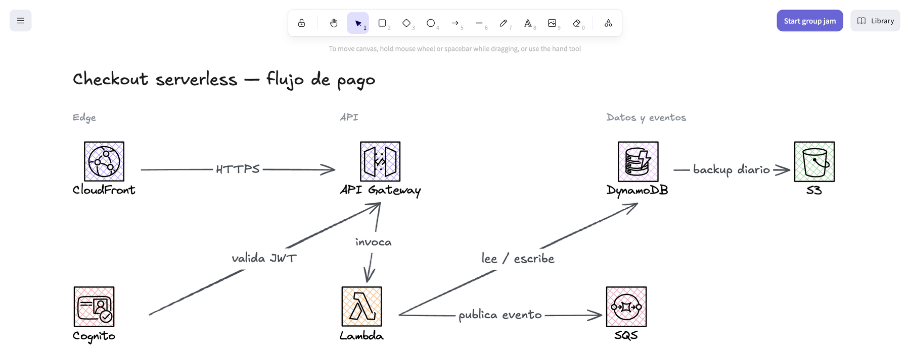
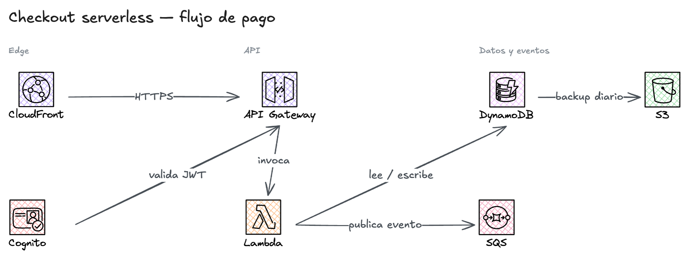
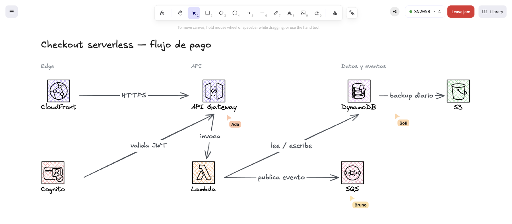

# Escalidrau

**A whiteboard for thinking out loud — with your AI and with your people, on the same canvas.**

Escalidrau is a macOS desktop app where you sketch diagrams by hand while your local AI agent draws right along with you: ask for the architecture of a system and it appears on your screen as it goes, fix it together, and when you want to show it to someone, invite them into a live jam.



## Install

Copy this into a terminal (macOS, Apple Silicon):

```bash
curl -fL https://github.com/aguara-guazu/escalidrau/releases/latest/download/Escalidrau-arm64.dmg -o /tmp/Escalidrau.dmg && open /tmp/Escalidrau.dmg
```

Drag **Escalidrau** to Applications, open it, and you are done. From then on it updates itself.

## Draw with your agent

You connect your agent once, from the app's **MCP** menu: one click for Claude Code, Claude Desktop or Codex. Nothing else to install.

After that it is all conversation:

- *"Draw the checkout flow with API Gateway, Lambda and DynamoDB"* → it appears on your canvas as it is written.
- *"Separate the diagrams that overlap and lay everything out horizontally"* → each diagram moves as a whole, arrows and labels included.
- *"Export it as a PNG to my desktop"* → ready to drop into a doc or a ticket.

Your agent **looks** at what it drew: it inspects the canvas and fixes what came out wrong — text overflowing a shape, crossed arrows, overlapping parts — before telling you it is done. It also sees what *you* do: move a box or change a label and it works from there.

Installed icon packs? It uses them. With the AWS pack, an AWS diagram comes out with the real icons:



## Jams: drawing with other people

Hit **Start group jam**, get a code, share it. Up to 10 people on the same canvas: you see each other's cursors live, each with their name and colour, and whatever anyone draws shows up on everyone's screen.



While the jam is live, the button turns into the room code plus a **Leave jam** button.

The nice part of the model: **the drawing travels straight between the computers** (peer to peer, like the multiplayer in a shooter), without passing through any server of ours. Which means:

- **Nothing is stored anywhere.** What you draw exists only in the apps of the people connected — whoever wants to keep it saves it on their machine (the app asks when you close it).
- **The room does not depend on whoever created it.** If the host leaves, everyone else keeps drawing and someone takes over automatically.
- **Everyone keeps their own agent.** It can be three people and three AIs on the same diagram.

## What else is in the box

- **Mermaid both ways.** Paste a `flowchart` and it becomes an editable drawing; or turn what you drew into Mermaid to paste into a README.
- **Drag and drop.** Drop an `.excalidraw` file or a Mermaid file on the window and it offers to import it.
- **Icon packs.** Install any of them from the public catalog in one click; they stay installed.
- **It updates itself.** On launch it fetches the latest version, installs it while showing you the progress, and tells you what changed.
- **Export** to PNG, SVG, or a file you can keep editing later.

## Quick answers

**Do I need an account?** No. No login, no servers, no telemetry.

**It says the app "is damaged".** That happens when you download the DMG with a browser or get it over chat, because the app is not signed by Apple. The install command above avoids it. If it already happened:

```bash
xattr -dr com.apple.quarantine "/Applications/Escalidrau.app"
```

**Intel Macs or Windows?** Apple Silicon only for now.

**Someone cannot join a jam.** Some restrictive networks block direct computer-to-computer connections. That is the network, not the app.

## For developers

While the app is open it exposes an MCP server at `http://localhost:3580/mcp` with these tools: `get_scene`, `get_layout`, `get_library`, `view_library`, `add_library_item`, `add_elements`, `update_elements`, `move_elements`, `delete_elements`, `import_mermaid`, `export_mermaid`, `view_canvas`, `export_image`, `wait_for_user_changes`.

```bash
npm install
npm run dev    # web (vite, :3579) + server (:3580)
npm run app    # Electron app in dev mode
npm run dist   # builds the DMG into desktop/release/
```

## License

MIT — see [LICENSE](LICENSE), which includes attribution for the dependencies the app redistributes.
